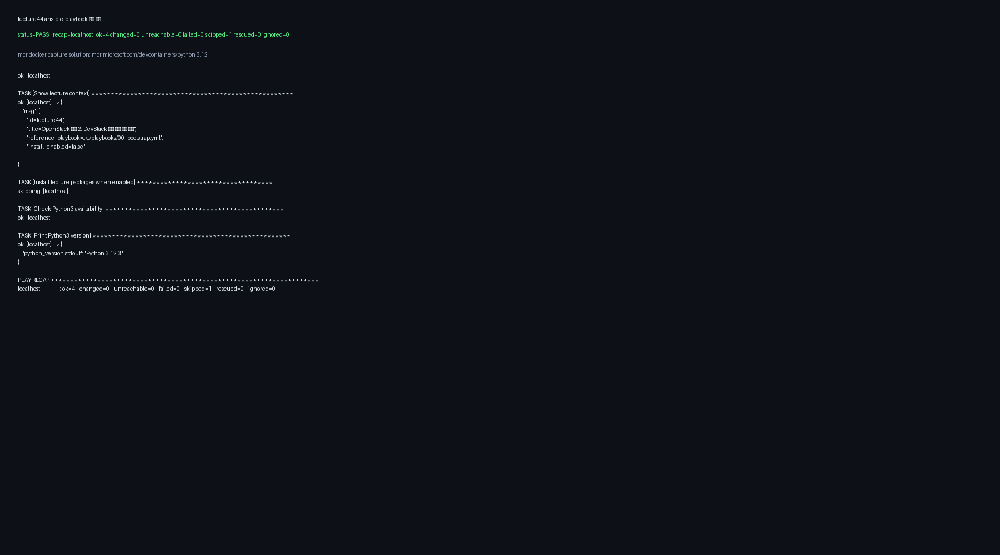
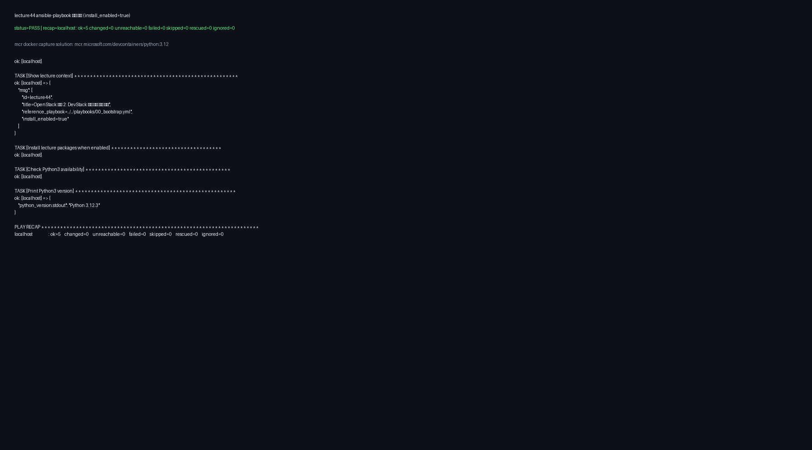

# lecture44 - OpenStack 입문 2: DevStack API/CLI 실습

## 1. 강의 개요
- 강의 번호: `44`
- 모듈: `Module F / OpenStack Hands-on Capstone`
- 난이도: `intermediate`
- 권장 시간: `60분`
- 모듈 초점: MicroStack/DevStack/Kolla Ansible로 OpenStack 운영 실습을 완성합니다.

## 2. 선수 조건
- lecture43 완료 또는 동등한 실무 경험
- Linux 기본 명령어(ls, cat, systemctl) 사용 가능

## 3. 학습 목표
- OpenStack 입문 2: DevStack API/CLI 실습 주제를 Ansible 중심으로 설명할 수 있다.
- 강의별 설치 및 점검 절차를 YAML 문서 기반으로 수행할 수 있다.
- 실습 결과를 AI 코치 프롬프트로 리뷰하고 개선할 수 있다.

## 4. 기술 스택 반영
### 핵심 스택 (Primary)
- `devstack`
- `openstack-cli`
- `nova`
- `neutron`
- `cinder`

### 보조 스택 (Secondary)
- (해당 없음)

### 선택 스택
- `horizon`
- `systemd`
- `journalctl`

### 적용 원칙
- 핵심 스택(Ansible/OpenStack/YAML) 중심으로 진행하며, 모든 작업은 재현 가능한 자동화 절차로 정리합니다.

## 5. 학습 흐름
- 오프닝 5분: 목표와 검증 기준 확인
- 핵심 작업 45분: 플레이북 실행, 결과 점검, 오류 수정
- 마무리 10분: 실행 로그 정리와 다음 강의 연결

## 6. 설치 계획
- 대상 인벤토리: `../../inventories/local/hosts.ini`
- 대상 호스트 그룹: `all`
### 설치 접근
- 사전 점검: Python/SSH/권한 확인
- 필수 패키지 설치는 playbook.yml에서 install_enabled=true일 때 실행
- 강의 종료 후 상태 점검 태스크로 검증
### 패키지
- `python3`
- `git`
- `curl`
- `jq`

## 7. 실행 절차
- 강의 플레이북: `./playbook.yml`
- 레퍼런스 플레이북: `../../playbooks/00_bootstrap.yml`
### 실행 명령
- `ansible-playbook -i ../../inventories/local/hosts.ini ./playbook.yml`
- `ansible-playbook -i ../../inventories/local/hosts.ini ./playbook.yml -e install_enabled=true`
- `ansible-playbook -i ../../inventories/local/hosts.ini ../../playbooks/00_bootstrap.yml`

## 8. 산출물과 검증
### 산출물
- 강의 실행 로그 또는 스크린샷 1개 이상
- AI 회고 노트(markdown) 1개
### 검증 기준
- playbook syntax error 없음
- 핵심 태스크 결과를 debug 출력으로 확인

## 9. AI 페어링 가이드
- 사전 점검 프롬프트: OpenStack 입문 2: DevStack API/CLI 실습 실습 전에 실패할 수 있는 지점 3개를 체크리스트로 만들어줘.
- 실습 중 프롬프트: 현재 실행 로그를 보고 원인-증상-조치 순서로 트러블슈팅 가이드를 작성해줘.
- 회고 프롬프트: 이번 강의에서 배운 자동화 패턴을 다음 강의에 재사용할 수 있게 YAML 템플릿으로 정리해줘.

## 10. 심화 연계 (선택)
- 연계 트랙: `OpenStack 입문 체험(MicroStack/DevStack/Kolla Ansible)`
- 연계 목표: OpenStack 입문 2: DevStack API/CLI 실습 학습 결과를 OpenStack 입문 체험(MicroStack/DevStack/Kolla Ansible) 시나리오와 연결한다.
### 추가 실습
- DevStack 단일 머신 설치 후 provider/self-service 네트워크 확인
- CLI로 인스턴스/네트워크/라우터/Floating IP 생성
- AWS/OpenStack 브릿지: Horizon 메뉴와 Nova/Neutron/Cinder 흐름을 AWS Console/EC2/VPC/EBS로 대응해 본다.
- 확장 프롬프트: 현재 강의(OpenStack 입문 2: DevStack API/CLI 실습) 결과를 MicroStack/DevStack/Kolla Ansible 비교표로 작성해줘.

## 11. 참고 파일
- `lecture.yml`: 강의 메타데이터
- `playbook.yml`: 강의 실행 플레이북

## 12. 실행 검증 결과 (자동 수집)
- 검증 일시: 자동 실행
- 실행 명령: `HOME=/home/Python_Ansible-Playbook ANSIBLE_LOCAL_TEMP=/home/Python_Ansible-Playbook/.ansible/tmp ANSIBLE_REMOTE_TEMP=/tmp/.ansible/tmp ANSIBLE_BECOME_ASK_PASS=False .venv/bin/ansible-playbook -i inventories/local/hosts.ini curriculum/lecture44/playbook.yml -e install_enabled=false`
- 검증 상태: `PASS` (exit_code=0)
- RECAP: `localhost : ok=4 changed=0 unreachable=0 failed=0 skipped=1 rescued=0 ignored=0`
- 올바른 예상 결과:
  - `Gathering Facts` 성공
  - `Show lecture context` 출력 확인
  - `Install lecture packages when enabled`는 `install_enabled=false` 기준으로 `skipped`
  - `Check Python3 availability`와 버전 출력 성공
- MCR 캡처 솔루션: `docker run --rm -v "$PWD":/work -w /work mcr.microsoft.com/devcontainers/python:3.12 bash -lc 'python3 -m pip install pillow && python3 scripts/render_captures.py'`
- 실행 로그: `results/lecture-verification/logs/lecture44.log`

## 13. 실행 검증 결과 (install_enabled=true 자동 수집)
- 검증 일시: 자동 실행
- 실행 명령: `HOME=/home/Python_Ansible-Playbook ANSIBLE_LOCAL_TEMP=/home/Python_Ansible-Playbook/.ansible/tmp ANSIBLE_REMOTE_TEMP=/tmp/.ansible/tmp ANSIBLE_BECOME_ASK_PASS=False .venv/bin/ansible-playbook -i inventories/local/hosts.ini curriculum/lecture44/playbook.yml -e install_enabled=true`
- 검증 상태: `PASS` (exit_code=0)
- RECAP: `localhost : ok=5 changed=0 unreachable=0 failed=0 skipped=0 rescued=0 ignored=0`
- 올바른 예상 결과:
  - `Gathering Facts` 성공
  - `Show lecture context` 출력 확인
  - `Install lecture packages when enabled` 성공(`ok` 또는 `changed`)
  - `Check Python3 availability`와 버전 출력 성공
- MCR 캡처 솔루션: `docker run --rm -v "$PWD":/work -w /work mcr.microsoft.com/devcontainers/python:3.12 bash -lc 'python3 -m pip install pillow && python3 scripts/render_captures.py --summary results/lecture-verification-install/summary.tsv --logs results/lecture-verification-install/logs --out results/lecture-verification-install/captures --title-suffix install_enabled=true'`
- 실행 로그: `results/lecture-verification-install/logs/lecture44.log`

---
이 문서는 `lecture.yml`을 기준으로 생성된 강의 안내서입니다.
